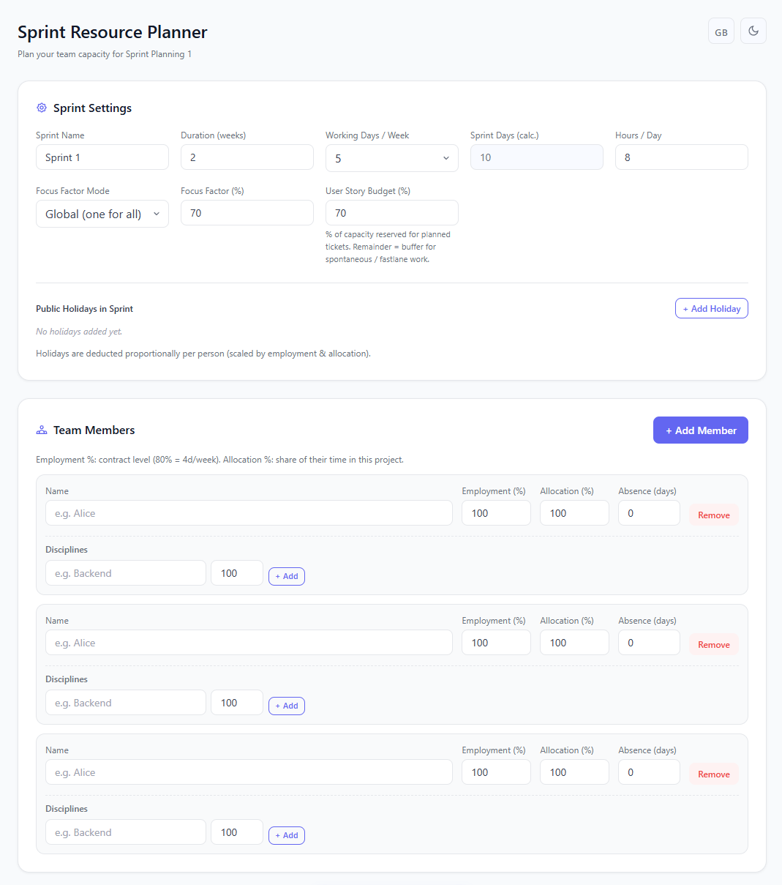

# Sprint Resource Planner

Single-file web app for planning team capacity during **Scrum Sprint Planning 1**.

📦 **[Download latest release](https://github.com/messiahfst/SprintRessources/releases/latest)** &nbsp;|&nbsp; 🚀 **[Open on GitHub Pages](https://messiahfst.github.io/SprintRessources/)**



---

## Get Started

1. Download `index.html` from the **[latest release](https://github.com/messiahfst/SprintRessources/releases/latest)**
2. Open it in any modern browser — done

No installation, no npm, no server required.

---

## Features

- **Sprint settings** — name, weeks × days/week, hours/day, focus factor (global or per person)
- **User Story Budget %** — splits capacity into planned scope vs. fastlane/buffer
- **Public holidays** — manual entry, deducted proportionally per person
- **DACH holiday reference** — auto-loads public holidays for 🇩🇪 Germany, 🇦🇹 Austria and 🇨🇭 Switzerland for the next 3 months (via [date.nager.at](https://date.nager.at)); one click to add any entry to the sprint
- **Team members** — Employment %, Allocation %, Absence days, individual Focus %
- **Disciplines** per person (e.g. Backend 60% / QA 40%) — capacity breakdown by discipline in results
- **Results table** — Available(d), Cap(d/h), Story Cap(d/h) without buffer, per person
- **Formula info box** — collapsible step-by-step explanation of the capacity calculation
- **Visual budget split bar** — User Stories vs. Fastlane/Buffer
- **Export** — Copy as Markdown or Plain Text
- **DE / EN** language switcher · **Dark mode** · **localStorage** persistence

---

## Capacity Formula

```
① Available (d) = (SprintDays − Holidays − Absence) × Employment% × Allocation%
② Capacity  (d) = Available × Focus%     (hours: × Hours/Day)
③ Story     (d) = Capacity × UserStoryBudget%
④ Buffer    (d) = Capacity × (1 − UserStoryBudget%)
```

The formula is shown inline in the app via the collapsible **"How the Formula Works"** info box.

---

## GitHub Pages (self-hosting)

1. Fork this repo
2. **Settings → Pages** → Source: `main` branch, root `/`
3. Live at `https://<your-username>.github.io/SprintRessources/`

---

## Changelog

### [v1.4.0](https://github.com/messiahfst/SprintRessources/releases/tag/v1.4.0) — 2025-07-10

**Mehrsprachigkeit / Multi-Language**
- Neue Sprachen: Français 🇫🇷, Italiano 🇮🇹, Español 🇪🇸 — vollständig mit ~70 i18n-Keys übersetzt
- Alle UI-Texte, Formeln, Tabellenspalten, Export-Strings und DACH-Ländernamen mehrsprachig
- Easter Egg: 🇨🇭 Schwiizerdütsch — durch Klick auf den Schweiz-Header im DACH-Feiertag-Bereich freischaltbar; Toast-Bestätigung, localStorage-Flag `srp-ch-unlocked`
- `buildMarkdown()` / `buildPlainText()`: alle hartcodierten `lang==='de'`-Checks durch `t('export-*')`-Aufrufe ersetzt
- `toLocaleDateString` in DACH-Referenz nutzt jetzt sprachspezifische Locale-Map (fr-FR, it-IT, es-ES, de-CH)

---

### [v1.3.0](https://github.com/messiahfst/SprintRessources/releases/tag/v1.3.0) — 2026-04-03

**Security**
- Added `Content-Security-Policy` meta tag (restricts scripts, styles, fetch to known origins)
- `loadState()` now sanitizes all member/holiday fields from localStorage (XSS root-cause fix)
- `rel="noopener noreferrer"` on all external links
- Removed Tailwind Play CDN — no external script dependencies; CSS inlined

**Performance**
- DACH API requests now run in parallel via `Promise.allSettled` (up to 6× faster)
- `loadDachHolidays()` respects a 5 s `AbortController` timeout per batch
- `saveState()` debounced (300 ms) — no more JSON.stringify on every keystroke

**Accessibility (WCAG 2.1)**
- All form labels now have correct `for`/`id` pairs (static + dynamic)
- Toast notification: `role="status"`, `aria-live="polite"`, `aria-atomic="true"`
- Copy-cells in the results table are keyboard-accessible (Enter / Space)
- Error message on missing team members: inline `role="alert"` instead of `alert()`
- Toggle buttons (DACH holidays, formula box): `aria-expanded` synced dynamically
- Language picker: `role="menu"` / `role="menuitem"` / `aria-haspopup` / `aria-expanded`; closes on Escape
- All decorative SVGs: `aria-hidden="true"`
- Remove buttons (holidays, discipline chips): descriptive `aria-label`
- `focus-visible` outlines on all buttons and copy-cells

**Code quality**
- `computeCapacity()` extracted as a pure, side-effect-free function
- `window._lastResult` / `window._dachLoaded` replaced with module-level `let`
- `buildMarkdown()` / `buildPlainText()` use local `_lastResult`

**DevOps**
- Added `.github/workflows/release.yml` — pushing a `v*.*.*` tag auto-creates a GitHub Release with `index.html` as download asset

**QA**
- Added `test.html` — 25 unit tests for the core capacity formula (open in browser to run)

### [v1.2.0](https://github.com/messiahfst/SprintRessources/releases/tag/v1.2.0) — 2026-03-26
- Added collapsible **formula info box** in the results section
- Added **DACH holiday reference** with live API data for DE / AT / CH (next 3 months)

### [v1.0.0](https://github.com/messiahfst/SprintRessources/releases/tag/v1.0.0) — 2026-03-25
Initial public release — all features listed above.

---

## License

MIT © [studer.rocks](https://studer.rocks)
